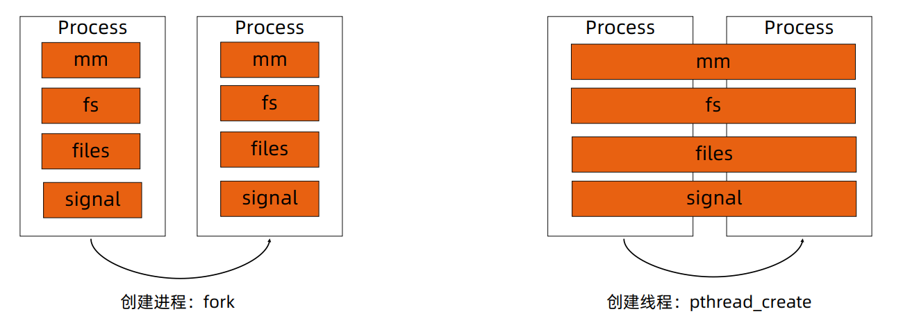
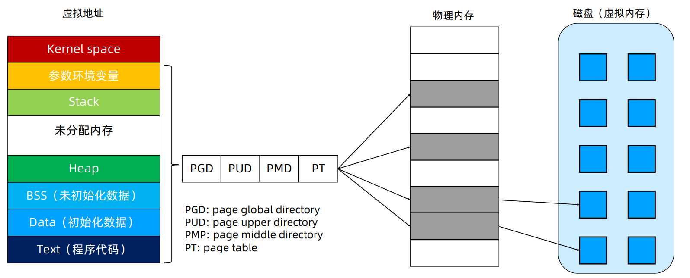
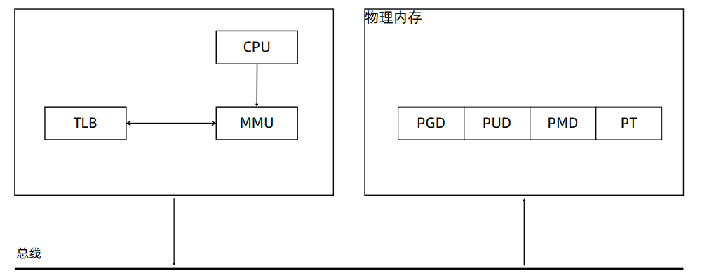
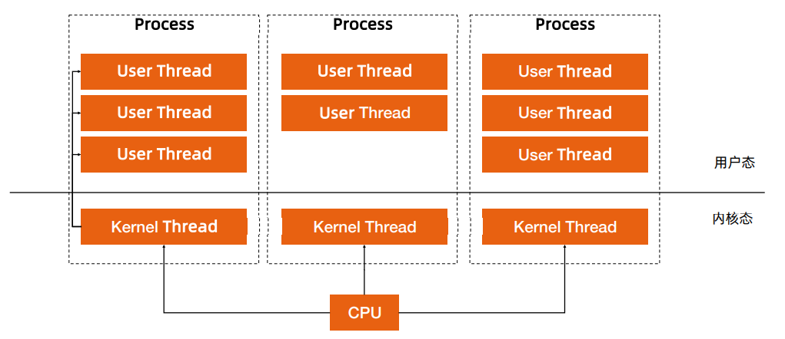
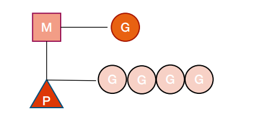
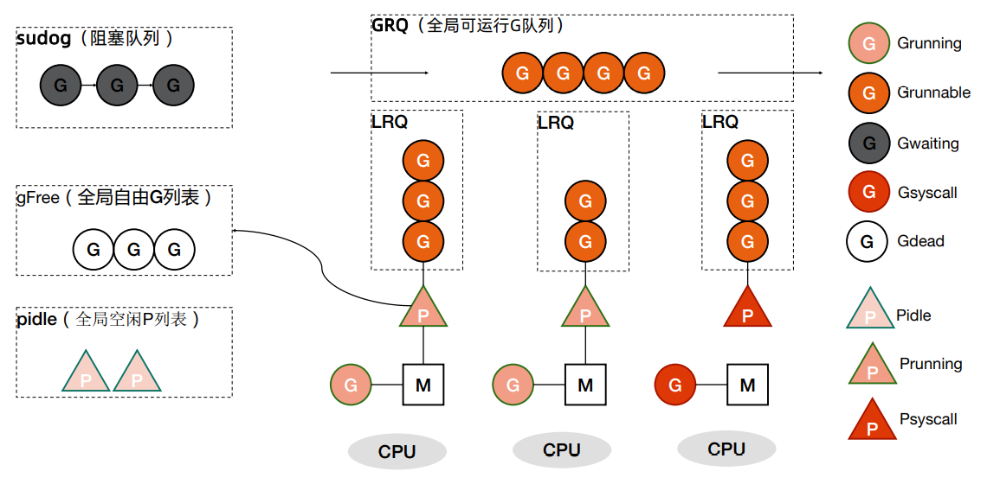

# GO Advanced<!-- omit in toc -->

- [线程加锁](#线程加锁)
  - [锁](#锁)
  - [Mutex 示例](#mutex-示例)
  - [WaitGroup 示例](#waitgroup-示例)
  - [Cond 示例](#cond-示例)
- [线程调度](#线程调度)
  - [深入理解 Go 语言线程调度](#深入理解-go-语言线程调度)
  - [Linux 进程的内存使用](#linux-进程的内存使用)
  - [CPU 对内存的访问](#cpu-对内存的访问)
  - [进程切换开销](#进程切换开销)
  - [线程切换开销](#线程切换开销)
  - [用户线程](#用户线程)
  - [Goroutine](#goroutine)
  - [GMP 模型细节](#gmp-模型细节)
  - [G 所处的位置](#g-所处的位置)
  - [Goroutine 创建过程](#goroutine-创建过程)
  - [将 Goroutine 放到运行队列上](#将-goroutine-放到运行队列上)
  - [调度器行为](#调度器行为)

## 线程加锁

### 锁

- Go 语言不仅仅提供基于 `CSP` 的通讯模型，也支持基于共享内存的多线程数据访问
- `Sync` 包提供了锁的基本原语
- `sync.Mutex` 互斥锁
  - `Lock()` 加锁，`Unlock()` 解锁
- `sync.RWMutex` 读写分离锁
  - 不限制并发读，只限制并发写和并发读写
- `sync.WaitGroup`
  - 等待一组 `goroutine` 返回
- `sync.Once`
  - 保证某段代码只执行一次
- `sync.Cond`
  - 让一组 `goroutine` 在满足特定条件时被唤醒

### Mutex 示例

`Kubernetes` 中的 `informer factory`

```go
// Start initializes all requested informers.
func (f *sharedInformerFactory) Start(stopCh <-chan struct{}) {
    f.lock.Lock()
    defer f.lock.Unlock()
    for informerType, informer := range f.informers {
        if !f.startedInformers[informerType] {
            go informer.Run(stopCh)
            f.startedInformers[informerType] = true
        }
    }
}
```

### WaitGroup 示例

```go
// CreateBatch create a batch of pods. All pods are created before waiting.
func (c *PodClient) CreateBatch(pods []*v1.Pod) []*v1.Pod {
    ps := make([]*v1.Pod, len(pods))
    var wg sync.WaitGroup
    for i, pod := range pods {
        wg.Add(1)
        go func(i int, pod *v1.Pod) {
            defer wg.Done()
            defer GinkgoRecover()
            ps[i] = c.CreateSync(pod)
        }(i, pod)
    }
    wg.Wait()
    return ps
}
```

### Cond 示例

`Kubernetes` 中的队列，标准的生产者消费者模式

`cond: sync.NewCond(&sync.Mutex{})`

```go
// Add marks item as needing processing.
func (q *Type) Add(item interface{}) {
    q.cond.L.Lock()
    defer q.cond.L.Unlock()
    if q.shuttingDown {
        return
    }
    if q.dirty.has(item) {
        return
    }
    q.metrics.add(item)
    q.dirty.insert(item)
    if q.processing.has(item) {
        return
    }
    q.queue = append(q.queue, item)
    q.cond.Signal()
}

// Get blocks until it can return an item to be processed. If shutdown = true,
// the caller should end their goroutine. You must call Done with item when you
// have finished processing it.
func (q *Type) Get() (item interface{}, shutdown bool) {
    q.cond.L.Lock()
    defer q.cond.L.Unlock()
    for len(q.queue) == 0 && !q.shuttingDown {
        q.cond.Wait()
    }
    if len(q.queue) == 0 {
        // We must be shutting down.
        return nil, true
    }
    item, q.queue = q.queue[0], q.queue[1:]
    q.metrics.get(item)
    q.processing.insert(item)
    q.dirty.delete(item)
    return item, false
}

```

## 线程调度

### 深入理解 Go 语言线程调度

- 进程：资源分配的基本单位
- 线程：调度的基本单位
- 无论是线程还是进程，在 `linux` 中都以 `task_struct` 描述，从内核角度看，与进程无本质区别
- `Glibc` 中的 `pthread` 库提供 `NPTL(Native POSIX Threading Library)`支持



### Linux 进程的内存使用



### CPU 对内存的访问

- CPU 上有个 `Memory Management Unit(MMU)` 单元
- CPU 把虚拟地址给 `MMU` ， `MMU` 去物理内存中查询页表，得到实际的物理地址
- CPU 维护一份缓存 `Translation Lookaside Buffer(TLB)`，缓存虚拟地址和物理地址的映射关系



### 进程切换开销

- 直接开销
  - 切换页表全局目录（PGD）
  - 切换内核态堆栈
  - 切换硬件上下文（进程恢复前，必须装入寄存器的数据统称为硬件上下文）
  - 刷新 TLB
  - 系统调度器的代码执行
- 间接开销
  - CPU 缓存失效导致的进程需要到内存直接访问的 IO 操作变多

### 线程切换开销

- 线程本质上只是一批共享资源的进程，线程切换本质上依然需要内核进行进程切换
- 一组线程因为共享内存资源，因此一个进程的所有线程共享虚拟地址空间，线程切换相比进程切换，**主要节省了虚拟地址空间的切换**

### 用户线程

无需内核帮助，应用程序在用户空间创建的可执行单元，创建销毁完全在用户态完成。



### Goroutine

Go 语言基于 `GMP` 模型实现用户态线程

- G：表示 `goroutine` ，每个 `goroutine` 都有自己的栈空间，定时器，初始化的栈空间在 2k 左右，空间会随着需求增长。
- M：抽象化代表内核线程，记录内核线程栈信息，当 `goroutine` 调度到线程时，使用该 `goroutine` 自己的栈信息。
- P：代表调度器，负责调度 `goroutine` ，维护一个本地 `goroutine` 队列，M 从 P 上获得 `goroutine` 并执行，同时还负责部分内存的管理。



### GMP 模型细节



### G 所处的位置

- 进程都有一个全局的 `G` 队列
- 每个 `P` 拥有自己的本地执行队列
- 有不在运行队列中的 `G`
  - 处于 `channel` 阻塞态的 `G` 被放在 `sudog`
  - 脱离 `P` 绑定在 `M` 上的 `G` ，如系统调用
  - 为了复用，执行结束进入 `P` 的 `gFree` 列表中的 `G`

### Goroutine 创建过程

- 获取或者创建新的 `Goroutine` 结构体
  - 从处理器的 `gFree` 列表中查找空闲的 `Goroutine`
  - 如果不存在空闲的 `Goroutine` ，会通过 `runtime.malg` 创建一个栈大小足够的新结构体
- 将函数传入的参数移到 `Goroutine` 的栈上
- 更新 `Goroutine` 调度相关的属性，更新状态为 `_Grunnable`
- 返回的 `Goroutine` 会存储到全局变量 `allgs` 中

### 将 Goroutine 放到运行队列上

- `Goroutine` 设置到处理器的 `runnext` 作为下一个处理器执行的任务
- 当处理器的本地运行队列已经没有剩余空间时，就会把本地队列中的一部分 `Goroutine` 和待加入的 `Goroutine` 通过 `runtime.runqputslow` 添加到调度器持有的全局运行队列上

### 调度器行为

- 为了保证公平，当全局运行队列中有待执行的 `Goroutine` 时，通过 `schedtick` 保证有一定几率会从全局的运行队列中查找对应的 `Goroutine`
- 从处理器本地的运行队列中查找待执行的 `Goroutine`
- 如果前两种方法都没有找到 `Goroutine` ，会通过 `runtime.findrunnable` 进行阻塞地查找 `Goroutine`
- 从本地运行队列、全局运行队列中查找
- 从网络轮询器中查找是否有 `Goroutine` 等待运行
- 通过 runtime.runqsteal 尝试从其他随机的处理器中窃取待运行的 `Goroutine`
