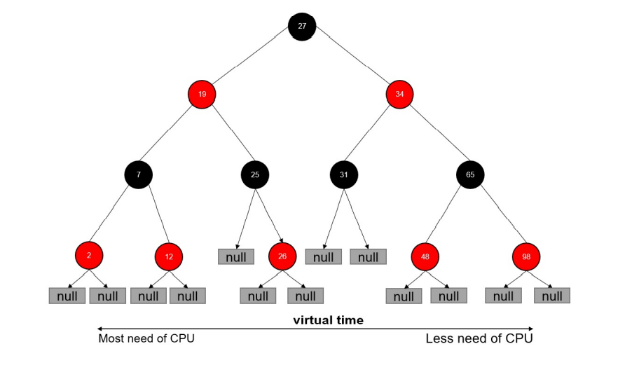
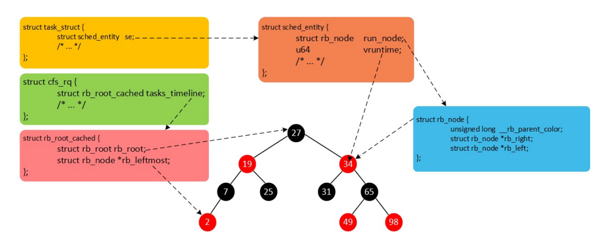

# Docker Core TEC  <!-- omit in toc -->

## Docker 基础

### 安装Docker

参考[Docker install](https://docs.docker.com/engine/install/)

### 容器操作

- 启动
  - docker run
    - it 交互
    - d  后台运行
    - p  端口映射
    - v  磁盘挂载
- 启动已终止容器
  - docker start
- 停止容器
  - docker stop
- 查看容器进程
  - docker ps
- 查看容器细节
  - docker inspect <containerid>
- 进入容器
  - docker attach
    - 通过 nsenter
    - PID=$(docker inspect --format "{{ .State.Pid }}" <container>)
    - $ nsenter --target $PID --mount --uts --ipc --net --pid
- 拷贝文件至容器内
  - docker cp file1 <containerid>:/file-to-path

### 初识容器

- cat Dockerfile
  ```Dockerfile
  FROM ubuntu
  ENV MY_SERVICE_PORT=80
  ADD bin/amd64/httpserver /httpserver
  ENTRYPOINT /httpserver
  ```
- 将Dockerfile打包成镜像
  - `docker build -t cncamp/httpserver:${tag} .`
  - `docker push cncamp/httpserver:v1.0`
- 运行容器
  - `docker run -d cncamp/httpserver:v1.0`

## Docker 核心实现

### NameSpace

- Linux Namespace 是一种 Linux Kernel 提供的资源隔离方案：
  - 系统可以为进程分配不同的 Namespace；
  - 并保证不同的 Namespace 资源独立分配、进程彼此隔离，即不同的 Namespace 下的进程互不干扰

#### Linux 内核代码中 Namespace 的实现

进程数据结构

```cgo
struct task_struct {
    ...
    /* namespaces */
    struct nsproxy *nsproxy;
    ...
}
```

Namespace 数据结构

```cgo
struct nsproxy {
    atomic_t count;
    struct uts_namespace *uts_ns;
    struct ipc_namespace *ipc_ns;
    struct mnt_namespace *mnt_ns;
    struct pid_namespace *pid_ns_for_children;
    struct net *net_ns;
}
```

#### Linux 对 Namespace 操作方法

- clone
  - 在创建新进程的系统调用时，可以通过 flags 参数指定需要新建的 Namespace 类型：
  - `// CLONE_NEWCGROUP / CLONE_NEWIPC / CLONE_NEWNET / CLONE_NEWNS / CLONE_NEWPID / CLONE_NEWUSER / CLONE_NEWUTS`
  - `int clone(int (*fn)(void *), void *child_stack, int flags, void *arg)`
- setns
  - 该系统调用可以让调用进程加入某个已经存在的 Namespace 中：
  - `int setns(int fd, int nstype)`
- unshare
  - 该系统调用可以将调用进程移动到新的 Namespace 下：
  - `int unshare(int flags)`

#### 隔离性 - Linux Namespace

- Pid namespace
  - 不同用户的进程就是通过 Pid namespace 隔离开的，且不同 namespace 中可以有相同 Pid。
  - 有了 Pid namespace, 每个 namespace 中的 Pid 能够相互隔离。
- net namespace
  - 网络隔离是通过 net namespace 实现的， 每个 net namespace 有独立的 network devices, IP addresses, IP routing tables, /proc/net 目录。
  - Docker 默认采用 veth 的方式将 container 中的虚拟网卡同 host 上的一个 docker bridge: docker0 连接在一起。
- ipc namespace
  - Container 中进程交互还是采用 linux 常见的进程间交互方法 （interprocess communication – IPC）, 包括常见的信号量、消息队列和共享内存。
  - Container 的进程间交互实际上还是 host 上具有相同 Pid namespace 中的进程间交互，因此需要在 IPC资源申请时加入 namespace 信息 - 每个 IPC 资源有一个唯一的 32 位 ID。
- mnt namespace
  - mnt namespace 允许不同 namespace 的进程看到的文件结构不同，这样每个 namespace 中的进程所看到的文件目录就被隔离开了。
- uts namespace
  - UTS("UNIX Time-sharing System") namespace允许每个 container 拥有独立的 hostname 和 domain name, 使其在网络上可以被视作一个独立的节点而非 Host 上的一个进程。
- user namespace
  - 每个 container 可以有不同的 user 和 group id, 也就是说可以在 container 内部用 container 内部的用户执行程序而非 Host 上的用户。

#### 关于 namespace 的常用操作

- 查看当前系统的 namespace：
  - `lsns -t <type>`
- 查看某进程的 namespace：
  - `ls -la /proc/<pid>/ns/`
- 进入某 namespace 运行命令：
  - `nsenter -t <pid> -n ip addr`

### Cgroups

- Cgroups （Control Groups）是 Linux 下用于对一个或一组进程进行资源控制和监控的机制；
- 可以对诸如 CPU 使用时间、内存、磁盘 I/O 等进程所需的资源进行限制；
- 不同资源的具体管理工作由相应的 Cgroup 子系统（Subsystem）来实现 ；
- 针对不同类型的资源限制，只要将限制策略在不同的的子系统上进行关联即可 ；
- Cgroups 在不同的系统资源管理子系统中以层级树（Hierarchy）的方式来组织管理：每个Cgroup 都可以包含其他的子 Cgroup，因此子 Cgroup 能使用的资源除了受本 Cgroup 配置的资源参数限制，还受到父 Cgroup 设置的资源限制。

#### Linux 内核代码中 Cgroups 的实现

进程数据结构

```cgo
struct task_struct {
    #ifdef CONFIG_CGROUPS
    struct css_set __rcu *cgroups; 
    struct list_head cg_list; 
    #endif
}
```

css_set 是 cgroup_subsys_state 对象的集合数据结构

```cgo
struct css_set {
    /*
    * Set of subsystem states, one for each subsystem. This array is
    * immutable after creation apart from the init_css_set during
    * subsystem registration (at boot time).
    */
    struct cgroup_subsys_state *subsys[CGROUP_SUBSYS_COUNT];
};
```

#### 可配额/可度量 - Control Groups (cgroups)

cgroups 实现了对资源的配额和度量

- blkio：   这个子系统设置限制每个块设备的输入输出控制。例如:磁盘，光盘以及 USB 等等
- cpu：     这个子系统使用调度程序为 cgroup 任务提供 CPU 的访问
- cpuacct： 产生 cgroup 任务的 CPU 资源报告
- cpuset：  如果是多核心的 CPU，这个子系统会为 cgroup 任务分配单独的 CPU 和内存
- devices： 允许或拒绝 cgroup 任务对设备的访问
- freezer： 暂停和恢复 cgroup 任务
- memory：  设置每个 cgroup 的内存限制以及产生内存资源报告
- net_cls： 标记每个网络包以供 cgroup 方便使用
- ns：      名称空间子系统
- pid:      进程标识子系统

#### CPU 子系统

- cpu.shares： 可出让的能获得 CPU 使用时间的相对值。
- cpu.cfs_period_us：cfs_period_us 用来配置时间周期长度，单位为 us（微秒）。
- cpu.cfs_quota_us：cfs_quota_us 用来配置当前 Cgroup 在 cfs_period_us 时间内最多能使用的 CPU 时间数，单位为 us（微秒）。
- cpu.stat ： Cgroup 内的进程使用的 CPU 时间统计。
- nr_periods ： 经过 cpu.cfs_period_us 的时间周期数量。
- nr_throttled ： 在经过的周期内，有多少次因为进程在指定的时间周期内用光了配额时间而受到限制。
- throttled_time ： Cgroup 中的进程被限制使用 CPU 的总用时，单位是 ns（纳秒）。

#### Linux 调度器

内核默认提供了5个调度器，Linux 内核使用 struct sched_class 来对调度器进行抽象：

- Stop 调度器，stop_sched_class：优先级最高的调度类，可以抢占其他所有进程，不能被其他进程抢占；
- Deadline 调度器，dl_sched_class：使用红黑树，把进程按照绝对截止期限进行排序，选择最小进程进行调度运行；
- RT 调度器， rt_sched_class：实时调度器，为每个优先级维护一个队列；
- CFS 调度器， cfs_sched_class：完全公平调度器，采用完全公平调度算法，引入虚拟运行时间概念；
- IDLE-Task 调度器， idle_sched_class：空闲调度器，每个 CPU 都会有一个 idle 线程，当没有其他进程可以调度时，调度运行 idle 线程。

#### CFS 调度器

- CFS 是 Completely Fair Scheduler 简称，即完全公平调度器。
- CFS 实现的主要思想是维护为任务提供处理器时间方面的平衡，这意味着应给进程分配相当数量的处理器。
- 分给某个任务的时间失去平衡时，应给失去平衡的任务分配时间，让其执行。
- CFS 通过虚拟运行时间（vruntime）来实现平衡，维护提供给某个任务的时间量。
  - vruntime = 实际运行时间*1024 / 进程权重
- 进程按照各自不同的速率在物理时钟节拍内前进，优先级高则权重大，其虚拟时钟比真实时钟跑得慢，但获得比较多的运行时间。

#### vruntime 红黑树

CFS 调度器没有将进程维护在运行队列中，而是维护了一个以虚拟运行时间为顺序的红黑树。 红黑树的主要特点有：

1. 自平衡，树上没有一条路径会比其他路径长出俩倍。
2. O(log n) 时间复杂度，能够在树上进行快速高效地插入或删除进程。



#### CFS进程调度

- 在时钟周期开始时，调度器调用 __schedule() 函数来开始调度的运行。
- __schedule() 函数调用 pick_next_task() 让进程调度器从就绪队列中选择一个最合适的进程 next，即红黑树最左边的节点。
- 通过 context_switch() 切换到新的地址空间，从而保证 next 进程运行。
- 在时钟周期结束时，调度器调用 entity_tick() 函数来更新进程负载、进程状态以及 vruntime（当前 vruntime + 该时钟周期内运行的时间）。
- 最后，将该进程的虚拟时间与就绪队列红黑树中最左边的调度实体的虚拟时间做比较，如果小于坐左边的时间，则不用触发调度，继续调度当前调度实体。



#### CPU 子系统练习

- 在 cgroup cpu 子系统目录中创建目录结构
    ```shell
    cd /sys/fs/cgroup/cpu
    mkdir cpudemo
    cd cpudemo
    ```
- 运行 busyloop
- 执行 top 查看 CPU 使用情况，CPU 占用 200%
- 通过 cgroup 限制 cpu
  - `cd /sys/fs/cgroup/cpu/cpudemo`
- 把进程添加到 cgroup 进程配置组
  - `echo ps -ef|grep busyloop|grep -v grep|awk '{print $2}' > cgroup.procs`
- 设置 cpuquota
  - `echo 10000 > cpu.cfs_quota_us`
- 执行 top 查看 CPU 使用情况，CPU 占用变为10%

#### cpuacct 子系统

- 用于统计 Cgroup 及其子 Cgroup 下进程的 CPU 的使用情况。
  - `cpuacct.usage`
- 包含该 Cgroup 及其子 Cgroup 下进程使用 CPU 的时间，单位是 ns（纳秒）。
  - `cpuacct.stat`
- 包含该 Cgroup 及其子 Cgroup 下进程使用的 CPU 时间，以及用户态和内核态的时间。

#### Memory 子系统

- memory.usage_in_bytes
  - cgroup 下进程使用的内存，包含 cgroup 及其子 cgroup 下的进程使用的内存
- memory.max_usage_in_bytes
  - cgroup 下进程使用内存的最大值，包含子 cgroup 的内存使用量。
- memory.limit_in_bytes
  - 设置 Cgroup 下进程最多能使用的内存。如果设置为 -1，表示对该 cgroup 的内存使用不做限制。
- memory.soft_limit_in_bytes
  - 这个限制并不会阻止进程使用超过限额的内存，只是在系统内存足够时，会优先回收超过限额的内存，使之向限定值靠拢。
- memory.oom_control
  - 设置是否在 Cgroup 中使用 OOM（Out of Memory）Killer，默认为使用。当属于该 cgroup 的进程使用的内存超过最大的限定值时，会立刻被 OOM Killer 处理。

#### Cgroup driver

systemd:

- 当操作系统使用 systemd 作为 init system 时，初始化进程生成一个根 cgroup 目录结构并作为 cgroup 管理器。
- systemd 与 cgroup 紧密结合，并且为每个 systemd unit 分配 cgroup。

cgroupfs:

- docker 默认用 cgroupfs 作为 cgroup 驱动。

存在问题：

- 在 systemd 作为 init system 的系统中，默认并存着两套 groupdriver。
- 这会使得系统中 Docker 和 kubelet 管理的进程被 cgroupfs 驱动管，而 systemd 拉起的服务由 systemd 驱动管，让 cgroup 管理混乱且容易在资源紧张时引发问题。

因此 kubelet 会默认--cgroup-driver=systemd，若运行时 cgroup 不一致时，kubelet 会报错。

#### Q & A

Q: 如何删除 /sys/fs/cgroup/ 下新建的文件夹？
A: 需要安装 cgroup-tools `apt install cgroup-tools` , 工具提供命令 `cgdelete memery:memerydemo` 需要提供相应子系统，通过这样的方式可以对相应的Cgroup进行删除。


