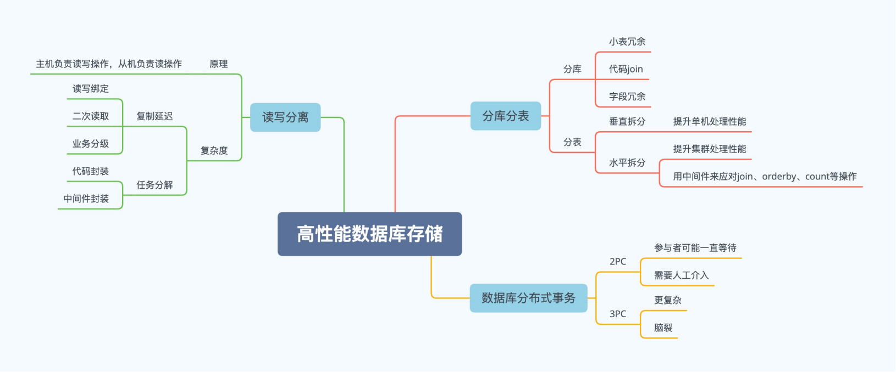

# Database Storage Architecture <!-- omit in toc -->

- [Database read/write separation architecture](#database-readwrite-separation-architecture)
  - [复杂度分析](#复杂度分析)
    - [复制延迟应对方法](#复制延迟应对方法)
    - [任务分解实现方式](#任务分解实现方式)
- [Database splitting and table splitting](#database-splitting-and-table-splitting)
  - [数据分库](#数据分库)
  - [数据分表](#数据分表)
    - [水平分表复杂度和应对方法](#水平分表复杂度和应对方法)
    - [水平分表伸缩瓶颈](#水平分表伸缩瓶颈)
- [Database Distributed Transactions](#database-distributed-transactions)
  - [分布式事务算法 - 2PC](#分布式事务算法---2pc)
  - [分布式事务算法 - 3PC](#分布式事务算法---3pc)
  - [MySQL XA](#mysql-xa)
- [Q & A](#q--a)

## Database read/write separation architecture

实现原理

1. 数据库服务器搭建主从集群，一主一从、一主多从都可以。
2. 数据库主机负责读写操作，从机只负责读操作。
3. 数据库主机通过复制将数据同步到从机，每台数据库服务器都存储了所有的业务数据。
4. 业务服务器将读写操作发给数据库主机，将读操作发给数据库从机。

如何判断要读写分离

1. 业务量持续增长。
2. 先优化（优化索引，加入缓存）再重构。

### 复杂度分析

1. 复制延迟
2. 任务分解

#### 复制延迟应对方法

1. 读写绑定
   - 写操作后的读操作指定发给数据库主服务器。
   - 缺点: 业务侵入很大，容易留坑。
2. 二次读取
   - 读从机失败后再读一次主机。
   - 缺点: 如果有很多二次读取，将大大增加主机的读操作压力。
3. 业务分级
   - 关键业务读写操作全部指向主机，非关键业务采用读写分离。
   - 缺点: 编码人员容易全部采用读写主机

优先选择方案3

#### 任务分解实现方式

程序代码封装模式(Sharding-JDBC)

1. 实现简单，基于 JDBC 封装。
2. 维护简单，无部署，无需考虑高性能高可用。
3. 每个语言都要实现一遍

中间件封装模式(Sharding-Proxy)

1. 实现复杂，独立服务器，需要实现连接管理。
2. 维护复杂，需要独立部署，并且要考虑集群部署支持高性能高可用。
3. 跨语言。

为何程序代码封装无需考虑高性能高可用部署？

程序代码封装实在应用程序内部嵌入Sharding-JDBC，自然将性能分布到各个程序中，已经实现了高性能高可用。

## Database splitting and table splitting

### 数据分库

1. Join 问题
   - 原本在同一个数据库中的表分散到不同数据库中，导致无法使用 SQL 的 Join 查询。
   - 解法
     - 小表冗余: 将一些小表在每个库中冗余一份，例如字典表。
     - 代码 Join: 在代码里面实现 Join 功能。
     - 字段冗余: 例如订单表直接记录商品类型。
2. 事务问题
   - 表分散到不同的数据库中，无法通过事务统一修改。
   - 解法: 分布式事务
   - 案例: 先扣商品库存，扣成功后生成订单，如果因为订单数据库异常导致生成订单失败，业务程序又需要将商品库存加上。而如果因为业务程序自己异常导致生成订单失败，则商品库存就无法恢复了，需要人工通过日志等方式来手工修复库存异常。

### 数据分表

1. 垂直拆分
   - 按列拆分，优化单机处理性能，常见于2B领域超多列的表拆分。
2. 水平拆分
   - 按行拆分，提升系统处理性能，常见于2C领域超多行的表拆分。

多大的表需要拆分？

1. B+Tree 的层数：3层大约是2000万条；
2. Innodb buffer pool：2000万数据，每条数据100字节，单表就2G了；
3. 数据量持续增长的表。

#### 水平分表复杂度和应对方法

【路由问题】: 路由算法进行计算数据归属。
【Count 操作】: 如何计算 Count。
【Join 操作】: 如何执行与其它表 Join。
【Order by】: 如何执行 Order by。

推荐使用第三方中间件实现对应的操作

水平分表能够通过加服务器来不断提升性能么？

#### 水平分表伸缩瓶颈

1. 每个应用都需要连接所有的分片，当应用数量增多后，数据库连接会逐渐成为瓶颈。以 MySQL 为例，默认100连接，实测50~100连接性能最高，超过200后会显著下降。
2. 单个Sharding-JDBC的聚合操作会有性能瓶颈

## Database Distributed Transactions

### 分布式事务算法 - 2PC

阶段1：单个参与者故障会导致整体事务失败。

阶段2：事务协调者故障会导致整体状态不一致，参与者一直等待事务协调者指令，可能需要人工修复

### 分布式事务算法 - 3PC

1. Yes 丢了会导致协调者取消事务。
2. 部分 preCommit 丢了会导致部分参与者超时取消事务，其它参与者收到了 preCommit 消息，然后超时提交事务，因此造成脑裂。
3. Ack 丢了会导致参与者超时提交事务。
4. doCommit 丢失会导致参与者超时提交事务。

2PC 和 3PC 哪个更好，应用更广？

实际应用中2PC更加广泛

1. 3PC比较复杂
2. 脑裂，处理更加麻烦

### MySQL XA

【外部 XA】: 跨多 MySQL 实例的分布式事务，由应用程序代码作为 2PC 的事务协调者。
【内部 XA】: 跨同一实例多存储引擎的事务，由 Binlog 作为 2PC 的事务协调者。

[详解Mysql分布式事务XA](https://blog.csdn.net/soonfly/article/details/70677138)

## Q & A

【判断题，请写出判断原因】

1. 读写分离主要是提升系统读性能，对写性能没有帮助。
2. 数据分库和数据分表都可以提升系统写性能。
3. 水平分表后，尽量用中间件来实现各种 SQL 操作。
4. 3PC 比 2PC 功能更强大，应该优先采取 3PC。
5. 2PC 中的事务协调者可以是代码，也可以是独立的系统。

【思考题】

为什么数据库系统自己不实现分库分表的功能，而 Redis、MongoDB 等却都提供 sharding 功能?

1. × 读和写都需要占用计算机系统资源，读写分离后对读和写的性能都会有相应的提升。
2. √ 分表后，单表的并发能力提高了，磁盘I/O性能也提高了，写操作效率提高
3. √ 避免手动实现Join、Count等操作
4. × 第一，3PC比较复杂 第二若出现脑裂情况处理起来更加复杂 实际使用更加推荐2PC
5. 不知道
6. 思考：前者是关系型数据库主要强调ACID规则，在分库分表上需要人为设计，代码层面无法实现分库分表，而后者是NoSQL无关系性，数据库的结构简单实现sharding较为方便
